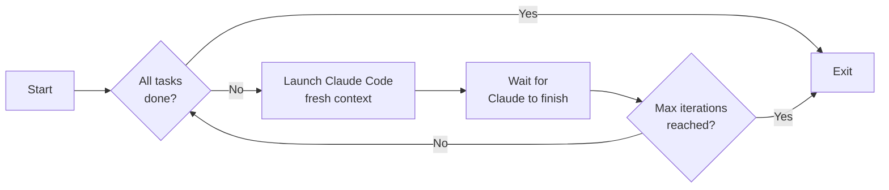
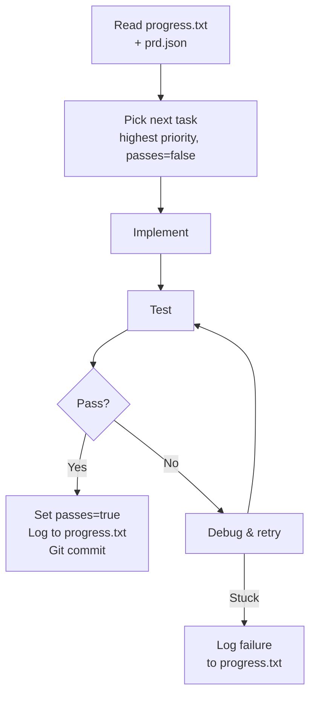
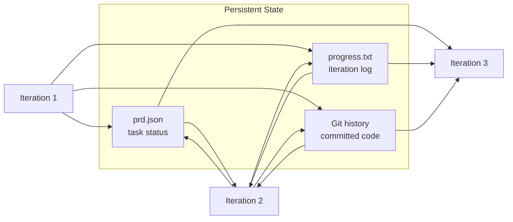

# Ralph

An iterative AI agent loop that runs Claude Code repeatedly to build software autonomously, one small task at a time. Based on [Geoffrey Huntley's Ralph pattern](https://ghuntley.com/loop/).

## How It Works

1. You define a list of small tasks in `prd.json`
2. `ralph.sh` loops Claude Code with a fresh context each iteration
3. Each iteration, Claude reads what was done before, picks the next task, implements it, tests it, and commits
4. When all tasks are done, the loop stops

Each iteration gets a **fresh context window** — Claude relies on `prd.json`, `progress.txt`, and git history for continuity. This prevents hallucination from context bloat.

### The outer loop (`ralph.sh`)



### What Claude does each iteration



### How state carries across iterations



## Prerequisites

- [Claude Code CLI](https://docs.anthropic.com/en/docs/claude-code) installed globally
- [jq](https://jqlang.github.io/jq/) for JSON parsing (`brew install jq`)
- Git initialized in your project

## Quick Start

### 1. Copy Ralph into your project

```bash
# Copy these files into your project (or a subfolder like scripts/ralph/)
cp ralph.sh cancel.sh PROMPT.md prd.template.json /path/to/your/project/
```

### 2. Create your task list

```bash
cp prd.template.json prd.json
```

Edit `prd.json` with your tasks. Each task needs:
- `id` — unique identifier (e.g. `TASK-001`)
- `title` — short description
- `description` — what and why
- `acceptanceCriteria` — how Claude knows it's done
- `priority` — execution order (1 = first)
- `passes` — set to `false` (Ralph flips to `true` when done)

### 3. Customize the prompt

Edit `PROMPT.md` to match your project:
- Add your build/test commands
- Mention your tech stack
- Add any project-specific rules

### 4. Run the loop

```bash
chmod +x ralph.sh cancel.sh
./ralph.sh 20
```

The argument is the max number of iterations (default: 10). Ralph stops early when all tasks are complete.

### 5. Monitor progress

In a separate terminal:

```bash
# Watch task completion status
watch -n2 'jq ".userStories[] | {id, title, passes}" prd.json'

# Check the progress log
cat progress.txt

# See commits Ralph made
git log --oneline
```

## Cancelling

- **Ctrl+C** — stops Ralph immediately after the current Claude call finishes
- **`./cancel.sh`** — from another terminal, tells Ralph to stop after the current iteration completes gracefully

## Files

| File | Purpose |
|------|---------|
| `ralph.sh` | The bash loop that runs Claude Code repeatedly |
| `cancel.sh` | Gracefully stop a running Ralph loop |
| `PROMPT.md` | Instructions Claude receives each iteration (customize for your project) |
| `prd.template.json` | Blank template — copy as `prd.json` and fill in your tasks |
| `prd.example.json` | Complete example (a Node.js todo CLI) showing what a real PRD looks like |
| `prd.json` | Your task list (created by you, gitignored) |
| `progress.txt` | Auto-populated log of what each iteration accomplished (gitignored) |

## Writing Good Tasks

**Do:** Break work into small, focused tasks that fit in one context window.

```json
{
  "id": "TASK-001",
  "title": "Add priority column to database",
  "acceptanceCriteria": [
    "Migration adds priority column with default 'medium'",
    "Typecheck passes"
  ]
}
```

**Don't:** Write tasks that are too big or vague.

```json
{
  "title": "Build the entire dashboard"
}
```

Good task size = one commit worth of work (add a field, create a component, wire up an endpoint).

## Tips

- **Always set a max iteration limit** as a cost safety net
- **Start small** — try 3-5 tasks first to see how it works
- **Include test/build checks** in acceptance criteria so Claude verifies its own work
- **Check `progress.txt`** if something goes wrong — it logs what was tried
- **Tasks run in priority order** — make sure dependencies come first

## References

- [Geoffrey Huntley - The Loop](https://ghuntley.com/loop/)
- [snarktank/ralph](https://github.com/snarktank/ralph)
- [Ralph Wiggum Guide by JeredBlu](https://github.com/JeredBlu/guides/blob/main/Ralph_Wiggum_Guide.md)
